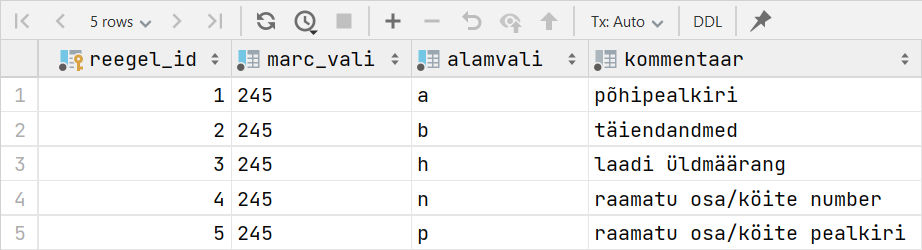
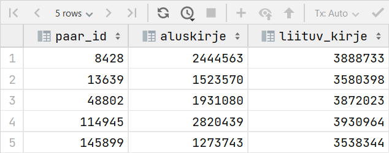
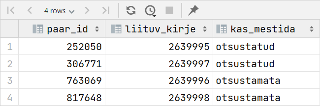
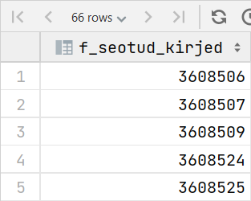
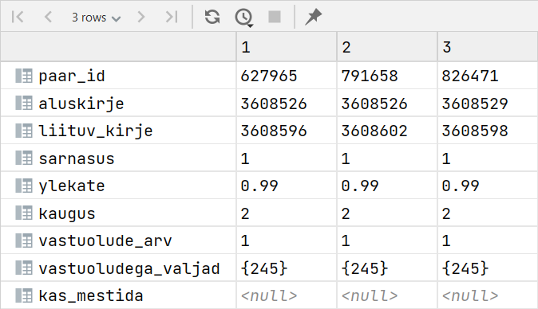
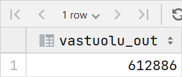
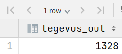

include::.asciidoctorconfig[]

= Bibliokirjete mestimise töövoo andmebaas
Martin Pajuste, 19. rühm, grupp J
:!chapter-signifier:
:coderay-linenums-mode: table
:doctype: book
:figure-caption: Joonis
:icons: font
:pdf-theme: theme.yml
:revremark: III etapp
:sectanchors:
:sectlinks:
:sectnums:
:source-highlighter: coderay
:source-language: SQL
:title-page:
:toc-title: Sisukord
:toc: left
:toclevels: 2

== Valdkonna ja mõistete kirjeldus

=== Sissejuhatus

Andmebaas on seotud raamatukogundusega, täpsemalt <<kataloog,kataloogi>> korrastamisega.

Mõningad järgnevatest mõistetest omavad tähendust ka väljaspool valdkonda, kuid neid tähendusi ei ole esitatud.

Käesolevas dokumendis kasutatakse sünonüümidena sõnasid kirje ja bibliokirje.

=== Mõistete loetelu

aluskirje:: kahest mestitavast kirjest allesjääv, vajadusel täiendatakse seda liituvast kirjest päritoleva infoga
bibliokirje:: reeglipäraselt esitatud bibliograafiaandmete kogum, mis võimaldab kirjeldatavat dokumenti täielikult identifitseerida footnote:624175[https://sonaveeb.ee/search/unif/dlall/rara/bibliokirje/1]
elektronkataloog[[elektronkataloog]]:: ühe või mitme raamatukogu kogusid peegeldav interaktiivne arvutipõhine andmebaas; sageli integreeritud raamatukogusüsteemi osa footnote:625652[https://sonaveeb.ee/search/unif/dlall/rara/elektronkataloog/1]
eksemplar:: sama trükise iga üksik teisik footnote:622950[https://sonaveeb.ee/search/unif/dlall/rara/eksemplar/1]
integreeritud raamatukogusüsteem (IRS)[[IRS]]:: arvutipõhine raamatukogusüsteem, mis koosneb suhteliselt iseseisvatest alamsüsteemidest e moodulitest mingi tegevuste rühma jaoks (nt kataloogimismoodul, laenumoodul, e-kataloog) footnote:625737[https://sonaveeb.ee/search/unif/dlall/rara/integreeritud%20raamatukogus%C3%BCsteem/1]
rahvusvaheline raamatu standardnumber (ISBN)[[ISBN]]:: Rahvusvaheline raamatu standardnumber; kümnekohaline numberkood, mis sisaldab kontrollnumbrit ja millele eelneb suurtähtlühend ISBN.
ISBN identifitseerib ainuliselt teose ühe trüki, mille on välja andnud üks teatud kirjastaja.
ISBNi annab rahvuslik ISBNi agentuur ja see number põhineb rahvusvahelisel standardil EVS-ISO 2108. footnote:623945[https://sonaveeb.ee/search/unif/dlall/rara/rahvusvaheline%20raamatu%20standardnumber/1]
kataloog[[kataloog]]:: raamatukogus leiduvaid teavikuid kirjeldav süsteemne andmekogu footnote:622797[https://sonaveeb.ee/search/unif/dlall/rara/kataloog/1]
kataloogija:: isik, kes tegeleb <<kataloogima,kataloogimisega>>
kataloogima[[kataloogima]]:: kataloogi jaoks kirjeid koostama ning katalooge koostama ja hooldama footnote:622798[https://sonaveeb.ee/search/unif/dlall/rara/kataloogima/1]
liituv kirje:: võimaliku topeltkirjena tuvastatud kirje, millest võib mestimisel lisanduda aluskirjesse infot
MARC-in-JSON[[MARC-in-JSON]]:: väljapakutud JSON-skeem MARC-kirjete JSON-vormingus esitamiseks footnote:[https://web.archive.org/web/20101120212425/http://dilettantes.code4lib.org/blog/2010/09/a-proposal-to-serialize-marc-in-json/]
MARC:: Ameerika Ühendriikide Kongressi raamatukogu poolt hallatav standard, mida kasutatakse bibliograafiliste ning seotud andmete masinloetaval kujul esitamiseks ja edastamiseks footnote:[https://www.loc.gov/marc/]
mestima:: andmekogumeid kokku liitma footnote:625890[https://sonaveeb.ee/search/unif/dlall/rara/mestima/1]
raamatukogu infosüsteem:: vaata <<IRS,integreeritud raamatukogusüsteem>>
raamatukoguhoidja::
. raamatukogunduslik elukutse, raamatukoguhoidja töö on kujundada inimeste lugemisharjumusi, toetada elukestvat õpet ja tagada ligipääs informatsioonile, teadmistele ja kultuurile ning toetada teadus-, loome- ja arendustegevust footnote:[https://www.kutseregister.ee/ctrl/et/Standardid/vaata/11094648]
. vastav ametikoht raamatukogus footnote:622775[https://sonaveeb.ee/search/unif/dlall/rara/raamatukoguhoidja/1]
raamatukoguvõrk:: territoriaalse v haldusliku ühtekuuluvuse, raamatukogutüübi vm alusel moodustunud raamatukogude süsteem footnote:622873[https://sonaveeb.ee/search/unif/dlall/rara/raamatukoguv%C3%B5rk/1]
teavik[[teavik]]:: mis tahes materiaalne objekt, millele on talletatud informatsioon, nt trükis, foto, heliplaat, kompaktketas footnote:623410[https://sonaveeb.ee/search/unif/dlall/rara/teavik/1]

=== Valdkonna probleemid

Raamatukoguvõrguga on aastate jooksul liitunud nii ülikoolide, riiklikud kui ka rahvaraamatukogud.
Iga uus liituja toob endaga kaasa veidi erineva kirjelduse mõnest varasemalt olemasolevast teavikust.
Lähtuvalt kirjete loomise detailsusest ja võimalikest vastuoludest kirjetes, ei ole raamatukogu infosüsteemis olnud võimalik sama teavikut kirjeldavaid bibliokirjeid automaatselt mestida.
Suurem probleem on just vanemate teavikutega, millel puudub ISBN.

Raamatukogudele on oluline andmete korrastatus, kuid tööd raskendab asjaolu, et aja jooksul, mil on kasutusel olnud ühtne elektronkataloog, on mitu korda muutunud kataloogimisreeglid.
Arvestades, et bibliokirjeid on praegusel hetkel ligikaudu 3 460 000, on kataloogijate pingutustest hoolimata siiski kirjeid, mis peegeldavad erinevate aegade iseärasusi.

Iga nimetuse kohta peaks olema üks kirje, mille juurde käivad erinevad eksemplarid.
Lugeja jaoks on elektronkataloogis leiduvad sama teaviku mitmekordsed kirjeldused segadust tekitavad.
Tihtipeale jääb arusaamatuks, kas ja kust raamatukogust soovitud teaviku leida võib.

=== Andmebaasi kasutajad

Peamised kasutajad on raamatukoguhoidjad, kes kontrollivad välise süsteemi poolt genereeritud mestitavate paaride sobivust lükates kõrvale valepositiivsed.
Eelisjärjekorras nähakse kataloogimisele spetsialiseerunud raamatukoguhoidjaid, kes tunnevad hästi MARC standardit ning raamatukoguvõrgus kokkulepitud kataloogimisreegleid.

== Ärireeglid ja nendest tulenevad seoste aarsused

. Kasutaja autendib ennast kasutades integreeritud raamatukogusüsteemi kasutajanime ja parooli.

. Igal Tegevusel on üks TegevuseTüüp, sama tüüpi Tegevusi saab sooritada 0 või enam. (1:n)

. Süsteemis logitakse Paariga tehtavad Tegevused.
Üks Kasutaja saab sooritada 0 või enam Tegevust, kuid iga konkreetne Tegevus on sooritatud kindla Kasutaja poolt. (1:n)

. Mestimist vajava Paariga võib olla sooritatud 0 või enam Tegevust. (1:n)

. Kontrollimaks antud Paari sobivust mestimiseks on määratud Reeglid, millele valitud Paar peab vastama.

. Paari vastuolu Reegliga märgitakse Vastuoluga.
Iga Vastuolu on seotud ühe kindla Paariga, Paaril võib olla 0 või enam Vastuolu. (1:n)

. Iga Vastuolu tähistab ühe kindla Reegli rikkumist, sama Reegli rikkumist võib näidata 0 või enam Vastuolu. (1:n)

. Kirjet ei saa iseendaga mestida.

. Üks Kirje võib esineda 0 või enamas Paaris nii alus- kui liituva kirjena. (1:n)

== Olem-seose diagramm

plantuml::ER_est.puml[format=png,title="Olem-seose diagramm"]

* Olem "Kasutaja" sisaldab IRS kasutajate kasutajanimesid.
Paroole ei salvestata.
* Olem "Tegevus" sisaldab infot paaridega sooritatud toimingute kohta.
* Olem "TegevuseTyyp" sisaldab infot süsteemis sooritatavate tegevuste tüüpidest.
* Olem "Paar" sisaldab infot mestimiskandidaatide kohta: kirjenumbrid ning numbrilised suurused kirjete tekstilise sarnasuse väljendamiseks.
* Olem "Kirje" sisaldab integreeritud raamatukogusüsteemi kirjenumbrit, kirjes sisalduvat teavet JSON (<<MARC-in-JSON, MARC-in-JSON>>) kujul ning metaandmeid.
* Olem "Vastuolu" sisaldab infot paaride vastuoludest reeglitega.
* Olem "Reegel" sisaldab reegleid, millele peavad mestimiseks kõlblikud paarid vastama.

== Mudel relatsioonidena

=== Funktsionaalsed sõltuvused ja normaalkujude kontroll

==== Kasutaja

****
Kasutaja ([.underline]#kasutajanimi#)
****

===== 3. normaalkuju

* [x] Relatsioonis on ainult atomaarse väärtusega üheatribuudiline primaarvõti.

==== TegevuseTyyp

****
TegevuseTyyp ([.underline]#nimi#)
****

===== 3. normaalkuju

* [x] Relatsioonis on ainult atomaarse väärtusega üheatribuudiline primaarvõti.

==== Tegevus

****
Tegevus ([.underline]#paar#, [.underline]#tegevusetyyp#, [.underline]#kasutaja#, [.underline]#toimumisaeg#, kommentaar)
****

===== Funktsionaalsed sõltuvused

[circle]
* paar, tegevusetyyp, kasutaja, toimumisaeg → kommentaar

===== 1. normaalkuju

* [x] Ei ole mitmeväärtuselisi atribuute.

===== 2. normaalkuju

* [x] Sekundaarne atribuut ei sõltu võtme alamhulgast.

===== 3. normaalkuju

* [x] Relatsioonis on ainult üks funktsionaalne sõltuvus, transitiivseid sõltuvusi ei ole.

==== Paar

****
Paar ([.underline]#aluskirje#, [.underline]#liituv_kirje#, sarnasus, ylekate, kaugus)
****

===== Funktsionaalsed sõltuvused

[circle]
* aluskirje, liituv_kirje -> sarnasus, ylekate, kaugus

===== 1. normaalkuju

* [x] Ei ole mitmeväärtuselisi atribuute.

===== 2. normaalkuju

* [x] Ükski sekundaarne atribuut ei sõltu võtme alamhulgast.

===== 3. normaalkuju

* [x] Relatsioonis on ainult üks funktsionaalne sõltuvus, transitiivseid sõltuvusi ei ole.

==== Kirje

****
Kirje ([.underline]#kirje_nr#, bkood2, bkood3, keel, viimane_uuendus, sisu)
****

===== Funktsionaalsed sõltuvused

[circle]
* kirje_nr -> bkood2, bkood3, keel, viimane_uuendus, sisu

===== 1. normaalkuju

* [x] Ei ole mitmeväärtuselisi atribuute.

===== 2. normaalkuju

* [x] Ükski sekundaarne atribuut ei sõltu võtme alamhulgast.

===== 3. normaalkuju

* [x] Relatsioonis on ainult üks funktsionaalne sõltuvus, transitiivseid sõltuvusi ei ole.

<<<

==== Vastuolu

****
Vastuolu ([.underline]#reegel#, [.underline]#paar#, info)
****

===== Funktsionaalsed sõltuvused

[circle]
* reegel, paar -> info

===== 1. normaalkuju

* [x] Ei ole mitmeväärtuselisi atribuute.

===== 2. normaalkuju

* [x] Sekundaarne atribuut ei sõltu võtme alamhulgast.

===== 3. normaalkuju

* [x] Relatsioonis on ainult üks funktsionaalne sõltuvus, transitiivseid sõltuvusi ei ole.

==== Reegel

****
Reegel ([.underline]#marc_vali#, [.underline]#alamvali#, kommentaar)
****

===== Funktsionaalsed sõltuvused

[circle]
* marc_vali, alamvali -> kommentaar

===== 1. normaalkuju

* [x] Ei ole mitmeväärtuselisi atribuute.

===== 2. normaalkuju

* [x] Sekundaarne atribuut ei sõltu võtme alamhulgast.

===== 3. normaalkuju

* [x] Relatsioonis on ainult üks funktsionaalne sõltuvus, transitiivseid sõltuvusi ei ole.

<<<

=== Olem-seose mudel teisendatuna relatsioonilisele kujule

NOTE: Olemitele, mille võtmeks on tekstiline tunnus või mille võti koosneb mitmest tunnusest, on lisatud kunstlik võti.

plantuml::ER_est_rel.puml[format=png,title="Relatsioonilisele kujule teisendatud mudel"]

// https://courses.cs.ut.ee/2023/Andmebaasid/spring/Main/Teamwork
// == III etapp

// Kasutades graafilise mudeli koostamise vahendit, eksportige SQL-skript. Lisage saadud SQL-laused oma töö teksti. Tehke vajadusel käsitsi (teksti redaktori abil) parandused eksporditud Create lausetesse. Dokumenteerige parandused.
// Realiseerige saadud andmebaas andmebaasisüsteemis PostgreSQL. Sisestage igasse relatsiooni 4-5 kirjet fiktiivsete andmetega.
// Formuleerige SQL’is 5 mõttekat päringut ja 2 tegevust oma andmebaasi kohta (näiteks andmete lisamine või muutmine). Tegevused vormistage protseduuridena. Lisage aruandesse nii süntaktiliselt korrektne päring, kui ka saadud vastus (tegevus ja tulemus). Ka siin pidage silmas selle ülesande põhieesmärki: demonstreerida oma teadmisi ja oskusi. Seega peaks need päringud kajastama teie SQL oskustaset. Vähemalt 3 päringut peavad hõlmama enam kui ühte relatsiooni. Kõigi päringute ja tegevuste kohta esitage:
// sõnaline sisuline lühikirjeldus;
// vastav protseduur või funktsioon SQL või protseduurilise SQL keeles (süntaktiliselt korrektsel kujul);
// päringutulemuse kuvapilt (kui andmebaasis on palju andmeid ja vastus on mahukas, siis esitage ainult osa tulemusest; aga nii, et oleks aru saada, et osa vastusest on välja jäetud)

== Andmebaasi loomine ja päringud

=== Andmebaasi loomine

Andmebaasi loomiseks vajalikud SQL-laused on käsitsi kirjutatud, seega ühestki graafilise mudeli koostamise vahendist eksporditud koodi muuta ei olnud vaja.

Mahukama projekti puhul kindlasti sellist käsitööd teha ei kannata.

==== Tabelite loomine ja kitsendused

[source,sql,linenums]
----
include::mestimine.sql[tag=tabelid]
----

==== Vaadete loomine

[source,sql,linenums]
----
include::mestimine.sql[tag=vaated]
----

==== Funktsioonide loomine

[source,sql,linenums]
----
include::mestimine.sql[tag=funktsioonid]
----

==== Protseduuride loomine

[source,sql,linenums]
----
include::mestimine.sql[tag=protseduurid]
----

=== Näidispäringud

==== Teose pealkirja võrdlemise reeglid

===== Kirjeldus

Kuva mestimisreeglid, mis on seotud teose pealkirja võrdlemisega.

===== Päring

[source%linenums,SQL]
----
SELECT * FROM reegel WHERE marc_vali = '245';
----

===== Ekraanipilt

==== Vastuolud autori nimes

===== Kirjeldus

Kirjepaarid, kus on ainult üks vastuolu reeglitega ja see on väljal 100, mis on autori nimi.
Samas on ka piisavalt väikese Levensteini kaugusegafootnote:[https://et.wikipedia.org/wiki/Levenshteini_kaugus], et ühes kirjetest võiks olla trükiviga või puuduv patronüümfootnote:624591[https://sonaveeb.ee/search/unif/dlall/rara/patron%C3%BC%C3%BCm/1].

// TODO motle indeksite kasutusele https://stackoverflow.com/a/11231965/1245497
// Important difference: Array operators (<@, @>, && et al.) expect array types as operands and support GIN or GiST indices

===== Päring

Vaate loomise päring on toodud lõigus <<Vaadete loomine>>.

[source%linenums,SQL]
----
SELECT paar_id,
       aluskirje,
       liituv_kirje
FROM mv_paarid
WHERE kaugus < 20                       -- <1>
  AND vastuolude_arv = 1                -- <2>
  AND '100' = ANY (vastuoludega_valjad) -- <3>
LIMIT 5;
----

<1> veerus kaugus on kirjete Levensteini kaugus
<2> ainult 1 vastuolu reeglitega
<3> MARC väli 100

===== Ekraanipilt

==== Valitud aluskirjega liituvad kirjed

===== Kirjeldus

Vaata, millised kirjed võiksid liituda kirjega number 2639992 ning kas nende paaride mestimiskõlbulikkuse üle on otsustatud.

===== Päring

Vaate loomise päring on toodud lõigus <<Vaadete loomine>>.

[source%linenums,SQL]
----
SELECT paar_id,
       liituv_kirje,
       CASE
           WHEN sooritatud_tegevused && ARRAY [1::smallint, 2::smallint] THEN 'otsustatud'
           ELSE 'otsustamata' END AS kas_mestida
FROM v_tegevused
WHERE aluskirje = 2639992;
----

===== Ekraanipilt

==== Seotud kirjed

===== Kirjeldus

Funktsioon ehitab graafi kasutades paar tabelis olevat infot, alustades nendest servadest, kus sisendkirje on aluskirjeks.
Rekursiivse päringuga lisatakse juurde paare, milles on senileitud alus- või liituv kirje.

===== Päring

Funktsiooni loomise päring on toodud lõigus <<Funktsioonide loomine>>.

[source%linenums,SQL]
----
SELECT f_seotud_kirjed(3608503);
----

===== Ekraanipilt

==== Seotud paarid

===== Kirjeldus

Näita, millised potentsiaalsed mestimiskandidaadid on seotud kirjega number 3608503 ning kas nende osas on mingi otsus vastu võetud.

===== Päring

Vaate loomise päring on toodud lõigus <<Vaadete loomine>>.

Funktsiooni loomise päring on toodud lõigus <<Funktsioonide loomine>>.

[source%linenums,SQL]
----
SELECT mp.*, vt.kas_mestida
FROM mv_paarid mp
         JOIN f_seotud_kirjed(3608503) fsk
              ON (mp.aluskirje = fsk.kirjenumber)
         JOIN v_tegevused vt USING (paar_id)
WHERE vastuolude_arv <= 1 -- <1>
  AND sarnasus = 1
  AND ylekate > 0.99
  AND kaugus < 10;  -- <2>
----

<1> lubame ühe võimaliku valepositiivse vastuolu reeglitega
<2> arvestame, et kirjes saab olla trükivigu ja lühendeid

===== Ekraanipilt

Päringu vastuses olevad andmed on transponeeritud.

==== Vastuolu lisamine

===== Kirjeldus

Kirjepaar, milles MARC välja 100 alamväli a sisaldab vastuolu mestimisreeglitega.

===== Päring

Protseduuri loomise päring on toodud lõigus <<Protseduuride loomine>>.

[source%linenums,SQL]
----
CALL sp_lisa_vastuolu(2311204, 4205660, '100', 'a', '[
  "RoehrichtKarlHermann",
  "RoeherichtKarlHermann"
]'::jsonb, NULL);
----

===== Ekraanipilt

==== Tegevuse logimine

===== Kirjeldus

Kasutaja 'ylo' lubas kirjete mestimise.

===== Päring

Protseduuri loomise päring on toodud lõigus <<Protseduuride loomine>>.

[source%linenums,SQL]
----
CALL sp_logi_tegevus(2312093, 3730553, 'ylo', 'luba mestimine', '', NULL);
----

===== Ekraanipilt

// [bibliography]
// == Viited

